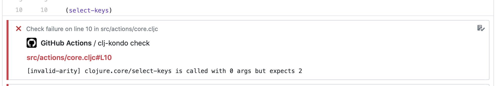
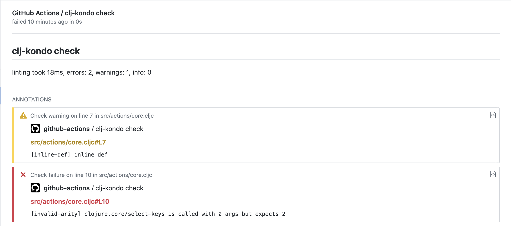

# Clojure Lint Action (using clj-kondo)

Run clj-kondo and annotate source code changes with results.

# Usage

```yaml
    steps:
    - uses: actions/checkout@v1
    - uses: DeLaGuardo/clojure-lint-action@v1
      with:
        clj-kondo-args: --lint src
        github_token: ${{ secrets.GITHUB_TOKEN }}
```




